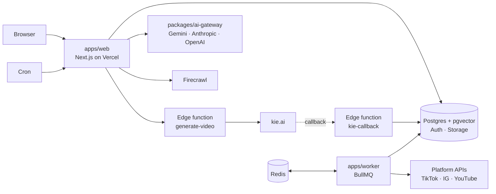

# Architecture

## The decision

Beyond Social is a **modular monolith with asynchronous workers**. It is not
microservices, and it should not become microservices yet.

This is a decision with an expiry condition rather than a preference. The
conditions that would reverse it are written at the end, so nobody has to
re-argue it from memory.

## What actually runs

Three deployable units and one managed platform. Worth saying plainly: this is
already a distributed system. The question was never "one process or many", it
was "how many, split along which seams".

The seams sit where the **operational profile** differs, which is the only
justification that survives production:

| Unit | Why it is separate |
| --- | --- |
| `apps/web` | Request-scoped, scales per request, must stay fast |
| `apps/worker` | Long-running and retryable, must survive a web deploy |
| Edge functions | Called by third parties, needs its own auth boundary |
| Supabase | Managed state with its own availability and scaling story |

Splitting `apps/web` further would add network hops and deploy surface without
separating anything that behaves differently under load.

Shared code lives in `packages/`: `ai-gateway` (task-based model routing,
cross-provider fallback, rate limiting, response cache), `prompt-engine` (the
retrieval and enhancement pipeline), `env` (Zod-validated configuration),
`sdk`, and the shared lint and TypeScript configs. These are the extraction
seams if a service is ever pulled out.

## How a video moves through the system

1. The user describes an idea in the conversation, or takes one from the trend
   feed.
2. `sendMessage` classifies the intent, so a question does not spend a credit on
   a video nobody asked for, and grounds the brief through the prompt engine.
3. It invokes the `generate-video` edge function, which submits to kie.ai and
   returns. **The request ends here.** A render cannot hold a web request open.
4. kie.ai calls `kie-callback` when the render finishes. The row is updated; the
   client, which has been polling, picks it up.
5. The user opens the draft in the editor to trim, caption, and adjust.
6. On publish, the worker posts to the platform APIs directly, with BullMQ
   retrying with exponential backoff.
7. Firecrawl runs on a schedule to refresh the trend feed, independent of any
   user.

## The five red flags, audited against this codebase

Four of the five are failure modes of **premature decomposition**, which is why
this audit mostly reads as support for the current shape. The fifth is a genuine
gap.

### 1. The synchronous trap

**Mostly avoided, one real exposure.**

The expensive path is already asynchronous, and correctly so: a slow renderer
cannot hold a request, and a deploy cannot lose an in-flight render.

The exposure is [`features/chat/actions.ts`](../apps/web/src/features/chat/actions.ts).
`sendMessage` calls a model synchronously to classify and to write the reply.
That is a deliberate trade, because the reply is the product and a queued reply
would be worse. It does mean a slow provider is a slow send.

**Missing: a deadline.** `providers.ts` accepts an optional `AbortSignal` and no
caller sets one. Retry and cross-provider fallback already exist in
`gateway.ts`, but a hang is not a failure, so a hung provider never triggers the
fallback written to survive it.

### 2. The God database

**Not applicable, and the discipline that matters is already enforced.**

One Postgres, three consumers, which is correct at this size. Splitting a
database buys independent scaling at the price of distributed transactions and
eventual consistency, and nothing here needs that trade yet.

Ownership is enforced in the database rather than by convention: RLS on every
table, the service-role key server-only, and security-definer views for the two
cases where a token must never be selectable. CQRS is not warranted; the read
patterns are not independently scalable enough to justify a second model.

**The real constraint is connections, not coupling.** Serverless functions plus
a worker plus edge functions exhaust Postgres connections long before the schema
becomes a bottleneck. Pooling is the thing to get right before launch.

### 3. The distributed monolith

**Honest about itself.**

The three units do share a release cycle: one monorepo, one pipeline. That is
not a distributed monolith, because nothing here claims to be independently
deployable microservices. It is a monorepo, which is a different thing and
deliberate. The edge functions already deploy separately, so the seam that most
needs independence has it.

The trap is future-shaped: extracting a service and leaving it on the shared
pipeline buys every cost of distribution and none of the benefit. Anything
extracted gets its own pipeline and a contract test, or it is not extracted.

### 4. The crunchy shell

**The model is right; the vocabulary does not transfer.**

mTLS between services is not meaningful here. Vercel to Supabase is TLS the
platform terminates, and there is no cluster to be soft in the middle of. The
principle underneath does transfer, and is applied:

- Every entry point authenticates: `CRON_SECRET` on cron routes,
  `KIE_CALLBACK_SECRET` on the render callback, bearer keys stored as SHA-256
  hashes on the public API.
- RLS means the database does not trust the application. A bad query cannot
  return another user's rows, because the database will not serve them.
- The service-role key never reaches a client bundle.

**Gap:** two edge functions were once deployed with `--no-verify-jwt` and had to
be corrected. That class of mistake is invisible until audited, so it belongs in
a deploy checklist rather than in someone's memory.

### 5. The blind cascade

**This is the real gap.**

`lib/observability/trace.ts` mints a trace id and returns it as `x-trace-id`.
It stops there. Nothing carries it into the edge functions, the callback, or the
worker, so the one flow that spans every unit in the system cannot be followed
end to end. When generation breaks in production, "where did this die" has no
answer.

There are also no circuit breakers. Retry with backoff exists in the gateway and
in BullMQ, which is right for a blip and wrong for an outage: retrying into a
provider that is down turns one failure into several and slows the recovery.

## What to fix, in order

1. **Deadlines on every provider call.** The plumbing exists; nothing sets it.
2. **Propagate the trace id** through the edge functions, callback, and worker,
   and log it at every hop.
3. **Connection pooling** before real traffic. This breaks first.
4. **Circuit breakers** per provider, so an outage fails fast instead of
   retrying into it.
5. **A deploy checklist** for edge functions, covering JWT verification.

## When to revisit

Extract a service when one of these is true, and not before:

- A component needs a **scaling profile** that adding worker replicas cannot
  meet. The render pipeline is the likely first candidate.
- A component needs a **different availability guarantee**, for example
  publishing continuing through a web outage.
- The team grows until one release cycle is a bottleneck rather than a
  convenience.
- A component needs a **runtime** the monorepo cannot host.

Extract that one component, give it its own pipeline and a contract test, and
leave the rest alone. There are no universal best practices here, only
trade-offs against latency, consistency, and the operational surface one team
can actually carry.
