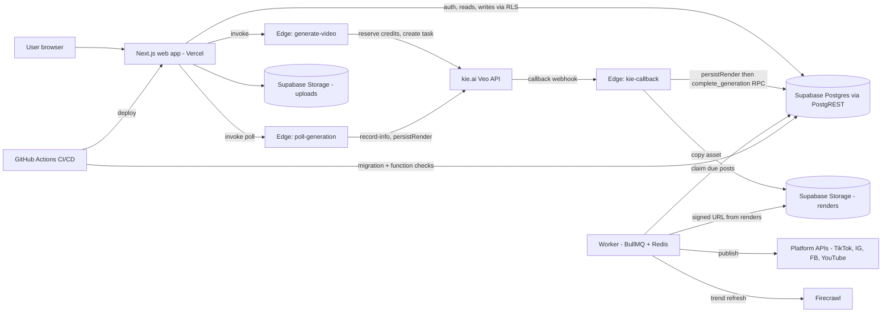
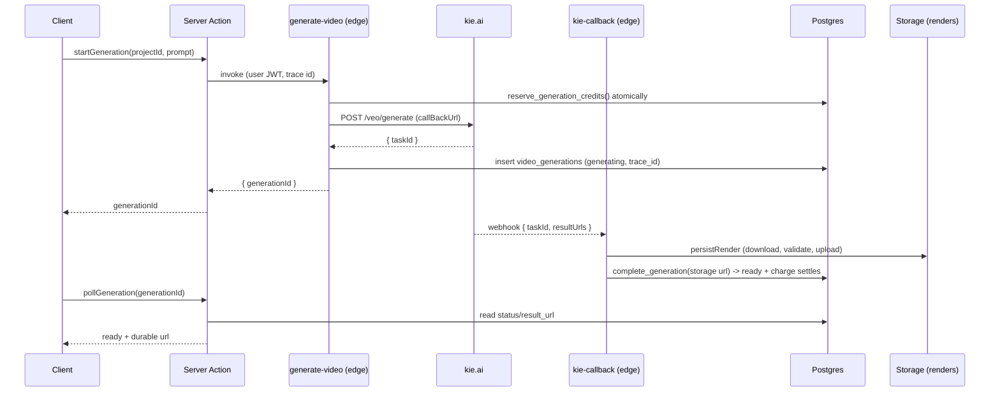
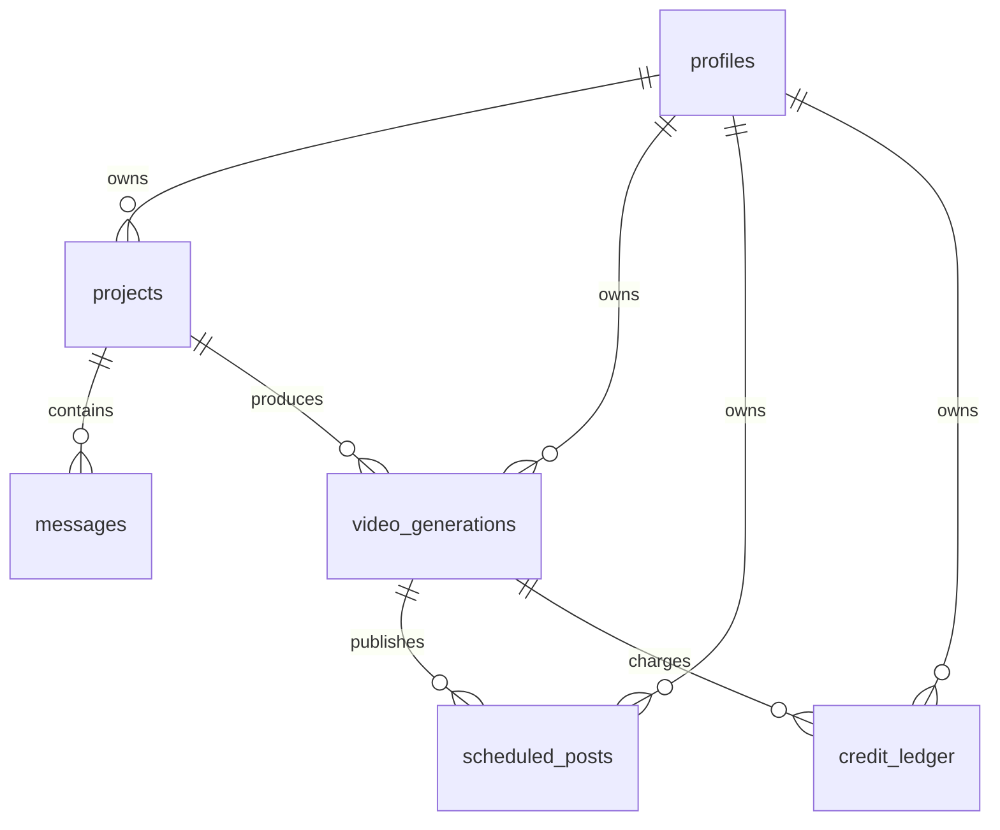
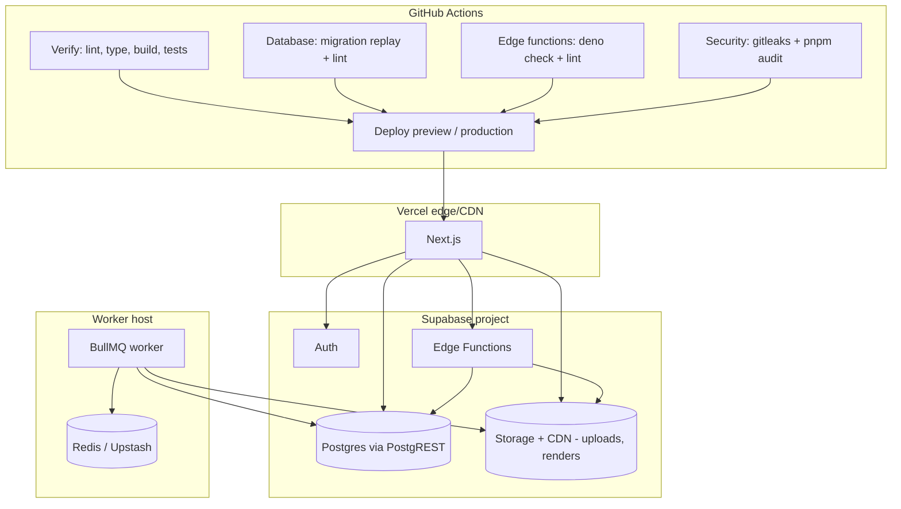

# Production Readiness Review

Beyond Social, architecture, scalability, security, and reliability review with a
prioritized path to production for millions of users. Scope is the codebase as of
`main` (Next.js web app, Supabase schema and edge functions, kie.ai video
generation, a BullMQ worker with real platform publishers, GitHub Actions CI/CD).
This review re-verifies every claim from the prior pass against current source, not
against its own summary; see [ARCHITECTURE.md](ARCHITECTURE.md) for the fuller
architectural audit this draws on.

## Executive Summary

The product has moved from "sound skeleton" to "mostly operational." Render
durability, the credit race, the publish worker, and CI/CD were the four biggest
gaps in the last review, and all four are now fixed in code, cited below file by
file. What is left is smaller and more mechanical: distributed rate limiting, a
nonce-based CSP, moving the webhook secret out of the query string, and
observability (error tracking, metrics, alerting), which remains the single
largest gap.

**Readiness score: 78 / 100** (see breakdown at the end), up from 64. The jump is
almost entirely C1, H4, and H5 landing, plus a CI/CD pipeline that did not exist
before.

---

## Critical Issues

### C1. kie.ai result URLs are temporary but stored as the source of truth (resolved)

- **Was:** `complete_generation` and the callback stored `resultUrls[0]` directly,
  so drafts, previews, and scheduled posts pointed at a link that expires.
- **Now:** `persistRender()` in
  [`supabase/functions/_shared/store.ts`](../supabase/functions/_shared/store.ts)
  downloads the kie.ai asset, validates it against SSRF (`isSafeRenderUrl`) and
  content-type/size limits, uploads it to the `renders` bucket, and returns a
  durable storage URL. Both call sites use it:
  [`supabase/functions/kie-callback/index.ts`](../supabase/functions/kie-callback/index.ts)
  (webhook path) and
  [`supabase/functions/poll-generation/index.ts`](../supabase/functions/poll-generation/index.ts)
  (dev polling path). The publish worker
  ([`apps/worker/src/processors/publish-post.ts`](../apps/worker/src/processors/publish-post.ts))
  reads `result_path` from the row and mints a signed URL for platforms to pull
  from, rather than trusting a stored public link that may have rotated.
- **One soft spot:** if the storage upload itself fails, `persistRender` falls
  back to returning the source kie.ai URL rather than failing the generation, so
  a render can still end up pointing at a URL that will expire, just less often
  and only on a storage-layer error. Worth an alert on that fallback path, not a
  rewrite.
- **Status: closed.** This was SCOPE.md item 5's central risk and it no longer
  applies to the current code.

### C2. No database connection pooler for serverless access (not applicable)

- **Was:** flagged as critical, assuming direct Postgres connections from
  serverless functions would exhaust Postgres's connection cap.
- **Correction, carried over from ARCHITECTURE.md:** this stack has no `pg`,
  Prisma, or Drizzle client anywhere. Every query goes through `supabase-js` to
  PostgREST over HTTP, and PostgREST holds the connection pool on Supabase's
  side. There is nothing here to point at Supavisor. The premise of the original
  finding does not hold.
- **What actually matters:** PostgREST's own pool size, which is a Supabase plan
  setting, and ordinary query discipline (indexes, pagination, column selection).
  This becomes a real finding again only if something in the codebase starts
  opening a direct Postgres connection.
- **Status: not applicable to the current architecture.** Downgraded out of
  Critical; tracked as a watch item, not a fix.

### C3. No observability (still open)

- **Checked:** no `Sentry`, `@sentry/*`, or any APM/metrics SDK anywhere in
  `apps/web`, `apps/worker`, or `package.json` dependencies. What exists is a
  structured `logger` and a request-tracing layer
  ([`apps/web/src/lib/observability/trace.ts`](../apps/web/src/lib/observability/trace.ts)):
  `sendMessage` now runs inside a trace, the id crosses to `generate-video` as a
  `traceparent` header, is stored on the generation row, and is read back by
  `kie-callback`. The publish worker now also logs the originating `trace_id`
  from `scheduled_posts` on both success and failure
  ([`publish-post.ts:166-173`](../apps/worker/src/processors/publish-post.ts)),
  closing the "worker carries no trace id" gap ARCHITECTURE.md still lists as
  open.
- **What is still missing:** none of this ships anywhere. There is no error
  tracker, no metrics backend, no alerting. A trace id that only ever reaches
  `console`/stdout is a correlation key with nowhere to correlate. An incident
  today is still found by someone noticing, not by a page.
- **Fix, unchanged:** Sentry for errors, plus a metrics/tracing sink
  (OpenTelemetry → Grafana/Datadog, or Vercel Analytics as a lighter start).
  Alert on 5xx rate, `kie-callback` failures, and credit anomalies.
- **Status: still the single biggest real gap.**

---

## High Priority

- **H1. Distributed rate limiting, still open.**
  [`apps/web/src/lib/rate-limit.ts`](../apps/web/src/lib/rate-limit.ts) is
  confirmed still a fixed-window in-memory `Map`, explicitly documented in its
  own header comment as per-instance and needing a shared store. No `upstash`
  dependency exists in the repo. Unchanged recommendation: `@upstash/ratelimit`
  keyed by IP and email, CAPTCHA after N failures.
- **H2. Webhook hardening, partially addressed, same partial as before.** The
  secret is compared in constant time
  ([`_shared/security.ts`](../supabase/functions/_shared/security.ts),
  `timingSafeEqual`), confirmed still wired into `kie-callback`. Still open: the
  secret still rides in the query string (`url.searchParams.get("token")` in
  `kie-callback/index.ts`), and there is still no dead-letter path if
  `complete_generation`/`fail_generation` RPCs fail after the secret check
  passes. `complete_generation` remains idempotent.
- **H3. Nonce-based CSP, still open.** `apps/web/next.config.ts` still sets
  `script-src 'self' 'unsafe-inline'`, with a comment pointing at this document.
  No nonce or `strict-dynamic` anywhere in `middleware.ts` or `next.config.ts`.
- **H4. Publishing pipeline reliability, resolved, beyond what was scoped.**
  The prior review's "remaining: wire the real provider, currently fails closed"
  is done. `apps/worker/src/lib/platforms/` has real implementations for
  `tiktok.ts`, `instagram.ts`, `facebook.ts`, and `youtube.ts`, dispatched
  through `publisherFor()` in
  [`apps/worker/src/lib/publish.ts`](../apps/worker/src/lib/publish.ts).
  `external_id` is stored on success
  (`publish-post.ts:161-164`). Publishing also gained fairness scheduling
  (per-user in-flight cap), a claim-based guard against double-publish
  (`claim_post_for_publish`), and correct handling of permanent vs. retryable
  failures via `UnrecoverableError`. This is materially ahead of where the last
  review left it.
- **H5. Credit race at start, resolved.**
  [`supabase/functions/_shared/credits.ts`](../supabase/functions/_shared/credits.ts)
  now reserves credits through a single atomic RPC,
  `reserve_generation_credits`, called from `generate-video` before the
  provider is dispatched (`generate-video/index.ts:185`). The function's own
  comment states the property directly: "nothing is dispatched until the
  credits are actually held." Two concurrent requests can no longer both pass a
  check-then-act gap.

## Medium Priority

- **M1. Caching, still open.** No Redis/Upstash cache layer found; trends and
  dashboard aggregates still query Postgres per load. Unchanged recommendation.
- **M2. Pagination, still open.** `apps/web/src/features/library/queries.ts`
  and `apps/web/src/features/schedule/lib/queries.ts` use `.order().limit()`
  with a fixed page size and no cursor/offset parameter; a user with a long
  history still cannot page past the first `PAGE_SIZE` rows. Add keyset
  pagination on `(created_at, id)`.
- **M3. Bundle size, not re-verified this pass.** No build-size regression
  check exists in CI; would need a bundle analysis run to confirm current
  numbers. Treat the prior ~210 kB figure as stale but directionally likely
  still true absent a fix.
- **M4. Idempotency keys, partially resolved.** `generate-video` itself still
  has no idempotency key check. However, scheduling (`publishing/actions.ts`)
  now takes an `idempotencyKey` and upserts on `(user_id, idempotency_key)`
  with `ignoreDuplicates: true`, and `credit_ledger.external_ref` now has a
  unique partial index for idempotent grants/charges. The generation-start path
  specifically is the remaining gap.
- **M5. `next/image` remote patterns / render CDN, resolved by C1.** Renders
  are now served from Supabase Storage (`renders` bucket) via `persistRender`,
  so the "once renders move to storage" condition is met. `next.config.ts`
  only configures `remotePatterns` for `images.unsplash.com`; renders are
  video, served via `<video>` / signed URLs, not through `next/image`, so no
  further change is needed here.

## Low Priority

- **L1. `reset_due_credits`, resolved by removal, not by scheduling.**
  Migration `0037_credits_and_models.sql` drops the function outright: credits
  no longer expire monthly, the ledger is append-only, so there is nothing left
  to schedule. The original finding assumed a design that no longer exists.
- **L2. Storage lifecycle, still open.** No expiry job for abandoned `uploads`
  found.
- **L3. Structured request IDs, resolved for the generation path.**
  `apps/web/src/lib/observability/trace.ts` threads a trace id from
  middleware through server actions into `logger`, across the edge-function
  boundary via `traceparent`, and now into the publish worker's logs via
  `scheduled_posts.trace_id`. Not yet wired into every route (see C3).
- **L4. E2E tests, still open.** No Playwright config or `*.spec.ts` under an
  `e2e` path found anywhere in the repo. CI runs unit/integration-style tests
  (`test:catalog`, `test:attachments`, provider/publishing/generation test
  suites) but nothing drives the app end to end.

---

## Scalability Review

Video compute is offloaded to kie.ai, so the app tier scales with request volume,
not CPU. With C2 downgraded to not-applicable, the real bottlenecks are
PostgREST's pool, the cache layer, and provider cost, not a self-managed
connection pooler.

| Users | What breaks                                                                  | Fix                                                                                                                               | Monthly cost signal                        |
| ----- | ---------------------------------------------------------------------------- | --------------------------------------------------------------------------------------------------------------------------------- | ------------------------------------------ |
| 10    | Nothing                                                                      | Supabase Free + Vercel Hobby                                                                                                      | ~$0 + kie.ai usage                         |
| 1k    | In-memory rate limit inconsistent across instances                           | Upstash rate limit (H1)                                                                                                           | Supabase Pro $25 + Vercel Pro $20 + kie.ai |
| 100k  | Read contention on dashboard/trends; PostgREST pool pressure; storage egress | Redis cache (M1); PostgREST plan tier bump; renders already on CDN-backed storage (C1 closed)                                     | Low hundreds + kie.ai (dominant)           |
| 1M    | Single primary write ceiling; publish worker throughput; cache stampede      | Horizontal workers (already fairness-scheduled per user); queue durability (QStash/SQS); request coalescing; partition hot tables | Low thousands + kie.ai                     |
| 10M   | Regional latency; single-region DB; cost of egress and generation            | Multi-region read replicas + edge cache; shard by `user_id`; commit-heavy tables partitioned; negotiated kie.ai pricing           | Dominated by kie.ai + egress               |

**Strategy, in order of value:** render durability (done) → observability →
distributed cache and rate limiting → CSP hardening → durable queue + horizontal
workers → read replicas → sharding/multi-region (only past ~1M active users; not
before).

Recommended primitives: **horizontal scaling** (stateless web/workers, worker
already fairness-scheduled), **CDN** (renders now on Supabase Storage, static
assets on Vercel), **Redis cache** (trends, aggregates, rate limits), **queue +
workers** (publishing done; trend refresh already cron-driven), **read
replicas** (dashboards, not yet needed). Microservices and sharding are **not**
justified until the single-primary write path is measurably the ceiling; see
ARCHITECTURE.md's "when to revisit" criteria.

---

## Security Review

- **Auth:** Supabase Auth; generic non-enumerating errors; RLS on every table;
  service role confined to edge functions and worker. Good.
- **Authorization:** owner-scoped RLS policies; privileged transitions only via
  SECURITY DEFINER functions locked to `service_role` (`reserve_generation_credits`,
  `complete_generation`, `claim_post_for_publish`, etc.). Good.
- **Injection:** parameterized Supabase queries; Zod validation at boundaries; no
  raw SQL from user input. Good.
- **SSRF (C1 follow-through):** confirmed fixed, not just planned.
  `persistRender` calls `isSafeRenderUrl` before fetching, and rejects anything
  outside kie.ai's expected origins before it ever reaches the fetch call
  (`_shared/fetch-guard.ts`).
- **XSS:** React escaping + CSP; CSP still allows `unsafe-inline` for scripts
  (H3, unchanged).
- **CSRF:** Supabase cookie auth + same-site; server actions are origin-checked
  by Next. Acceptable.
- **Secrets:** `.env` git-ignored; service role never reaches the browser.
  Now enforced in CI: `.github/workflows/security.yml` runs `gitleaks` over full
  git history and asserts no `.env*` file (other than `.example`) is tracked, on
  every PR, every push to `main`, and weekly.
- **Rate limiting / brute force:** present but per-instance (H1, unchanged); add
  CAPTCHA.
- **Webhook:** shared-secret in the query string, timing-safe compare (H2,
  unchanged from last review).
- **File uploads:** private bucket, per-user path policy. `persistRender` now
  enforces content-type allowlist and a byte-size cap on renders specifically;
  general upload virus scanning is still not present.
- **Dependency and secret scanning:** new since last review.
  `.github/workflows/security.yml` runs `pnpm audit` (fails on critical) and
  `gitleaks` on every PR and weekly.
- **Cookies:** `@supabase/ssr` sets secure, http-only cookies; confirm `Secure`
  in prod.

---

## Performance Review

- **Target P95 < 200 ms** is achievable for reads once caching (M1) lands;
  connection pooling is no longer a blocker (C2 not applicable). Not
  independently measured this pass.
- **Frontend:** no obvious unnecessary re-renders; images optimized (AVIF/WebP);
  auth-route bundle size not re-verified (M3).
- **Backend:** generation is async (non-blocking); polling every 3 s is fine for
  demo but should prefer the webhook in production to cut read load, unchanged
  from prior review.
- **Publishing:** now fairness-scheduled per user (max 3 in-flight) with a
  20-job worker concurrency, up from a queue-wide cap of 5 that let one user's
  backlog starve everyone else. This is new since the last review.

---

## Database Review

Schema is normalized, fully RLS'd, and indexed on the hot paths. Since the last
review, the credit model was corrected: `credit_ledger` is now the single source
of truth (migration `0037`), with `profiles.credits_total`/`credits_used` as a
trigger-maintained derived cache rather than a second wallet that could drift.
`credit_ledger.external_ref` has a unique partial index for idempotent grants.

Gaps: keyset pagination (M2), and, at very high scale, partitioning `messages`
and `video_generations` by month or hashing by `user_id`. Connection pooling is
removed from this list; it does not apply (C2).

Migrations now have their own CI gate:
[`.github/workflows/database.yml`](../.github/workflows/database.yml) replays
every migration from empty against a fresh Supabase instance and lints the
schema, on every PR touching migrations.

---

## API Review

- Edge functions: correct method guards, CORS, JWT verification where required,
  generic errors. `generate-video` validates input and now reserves credits
  atomically before dispatch (H5). Idempotency on `generate-video` itself is
  still open (M4).
- Server actions return typed discriminated unions; validated with Zod; no data
  leakage. Publishing actions now carry an idempotency key. Good.
- Edge functions gained their own CI gate since the last review:
  [`.github/workflows/edge-functions.yml`](../.github/workflows/edge-functions.yml)
  runs `deno check` and `deno lint` across every function entry point, closing
  the gap that let a renamed helper (`uploadImage` → `uploadFile`) ship broken
  and merge green.
- Consistent error envelopes and request IDs across every route: still open
  (L3, partial).

---

## Infrastructure Review

- **Deploy:** Vercel (web), Supabase (DB/Auth/Storage/Edge Functions). Worker
  still needs a host (Railway/Fly/Render) with Redis; not found provisioned in
  this repo.
- **CI/CD, resolved, this was the other major gap.**
  [`.github/workflows/ci.yml`](../.github/workflows/ci.yml) gates every PR on
  format, lint, typecheck, build, and the full test suite (AI gateway, Gemini
  provider, prompt engine, publishing, generation intent, optimization, trends,
  social OAuth, analytics), then deploys previews on PRs and production on
  merge to `main` via `vercel deploy`, with a post-deploy health check against
  the production URL. `database.yml` and `edge-functions.yml` add migration and
  Deno-side checks that did not exist before. `security.yml` adds secret and
  dependency scanning.
  **Caveat:** per the team's own recent history (`Correct the CI blocker
diagnosis: it's a billing issue, not a missing VERCEL_TOKEN`), the pipeline's
  production deploy step has been blocked by a Vercel billing issue, not a
  pipeline defect. The workflow itself is sound; whether it is currently
  green depends on that account issue being resolved, which is outside this
  document's scope to verify.
- **Local infra:** `docker-compose.yml` for Redis still not found; the worker's
  local dependency on Redis is still undocumented as a one-command setup.
- **HTTPS/HSTS:** headers set; enforce `Secure` cookies and HTTPS-only in prod.
- **Secrets:** Vercel/Supabase project envs; never in the repo, and now
  continuously checked (security.yml).

---

## Cost Optimization

kie.ai generation is the dominant variable cost and scales linearly with videos;
charge-on-completion is confirmed still correct
(`reserveCredits`/`complete_generation` settle on success, `abandonRun` refunds
on failure). Storage egress is now a real, not hypothetical, line item since C1
is closed and renders live in Supabase Storage, put a CDN/cache-control policy
in front of the `renders` bucket. Postgres and Vercel are minor until ~100k
users. Use Upstash (pay-per-request) for cache/rate-limit rather than an
always-on Redis at low scale. Kubernetes is not justified; serverless + a single
worker host is cheaper and simpler well past launch.

---

## Refactoring Suggestions

- Extract a `lib/data/*` repository layer so components/actions never call
  Supabase directly, one place to add caching, pagination, and tracing.
- Share the generation status enum and DTOs between the web app and edge
  functions via a small `packages/contracts` package to prevent drift. Partially
  mitigated already by `edge-functions.yml`'s typecheck, but a shared package
  would remove the duplication rather than just check it.
- Introduce a typed `Result<T, E>` helper to standardize action/edge-function
  returns. `credits.ts`'s `Reservation` union is a good local example already;
  worth generalizing.

---

## Migration Plan

1. ~~**Durability (C1):** persist renders in the callback and poll path, store
   storage paths.~~ **Done.**
2. ~~**Publish worker (H4):** claim-and-publish loop with retries; wire real
   providers.~~ **Done**, and extended with per-user fairness scheduling.
3. ~~**Credit race (H5):** reserve credits atomically before dispatch.~~
   **Done.**
4. ~~**CI/CD:** gate PRs, deploy pipeline, migration and edge-function
   checks.~~ **Done**, pending the Vercel billing issue being resolved on the
   account side.
5. **Observability (C3):** Sentry + log drain + alerts. **Next up, and now the
   clear top priority** since everything above this line either landed or turned
   out not to apply.
6. **Rate limit + webhook (H1, H2):** Upstash limiter; header-based webhook
   secret + DLQ.
7. **CSP nonce, caching, pagination (H3, M1, M2).**
8. **Storage lifecycle, E2E tests (L2, L4).**

Each step is independently shippable and reversible.

## Production Readiness Score (/100)

| Area                      | Score      | Notes                                                                                              |
| ------------------------- | ---------- | -------------------------------------------------------------------------------------------------- |
| Architecture & modularity | 9/10       | Clean separation; async generation; unchanged from last review                                     |
| Data model & RLS          | 9/10       | Indexed, owner-scoped, idempotent functions; ledger corrected                                      |
| Security                  | 7/10       | RLS solid, secret/dependency scanning added; CSP + rate limit + webhook still to harden            |
| Reliability               | 9/10       | Render durability, credit race, and publish worker all fixed                                       |
| Scalability               | 7/10       | Connection pooling concern retired as inapplicable; still needs cache and rate limiting            |
| Performance               | 6/10       | Good foundation; unproven under real load; unchanged                                               |
| Observability             | 2/10       | Tracing exists end to end; still nothing ingests it                                                |
| DevOps / CI-CD            | 8/10       | Full pipeline now exists; production deploy currently blocked by a billing issue, not the pipeline |
| Cost control              | 8/10       | Charge-on-completion confirmed; storage egress now a real, managed cost                            |
| **Total**                 | **78/100** | Up from 64; the structural gaps closed, observability is what's left                               |

## Next Recommended Task

**Fix C3 (observability).** It is now the only Critical-severity item still
open. Everything that used to sit ahead of it in priority, render durability,
the credit race, and the publish worker, has already shipped. Wire Sentry for
error tracking and pick a metrics/tracing sink; the trace id already exists
end to end and just needs somewhere to land.

---

## Diagrams

### System architecture

### Generation request lifecycle

### Database ER (core tables)

### Deployment architecture

