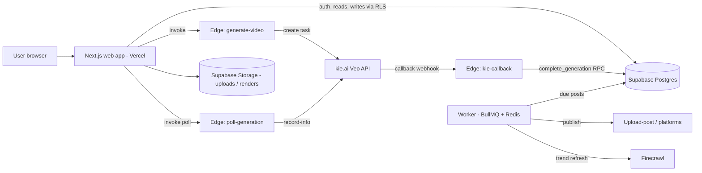
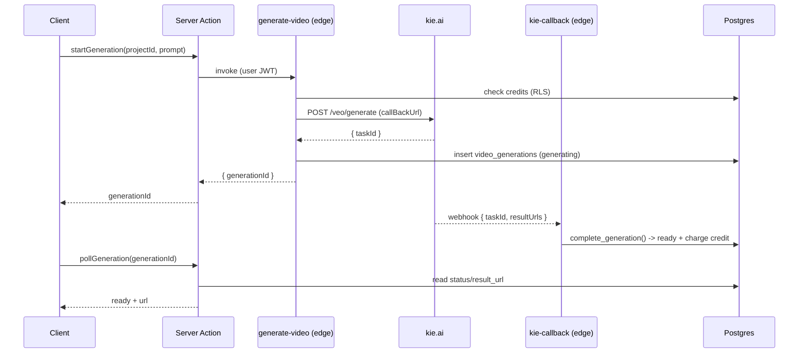
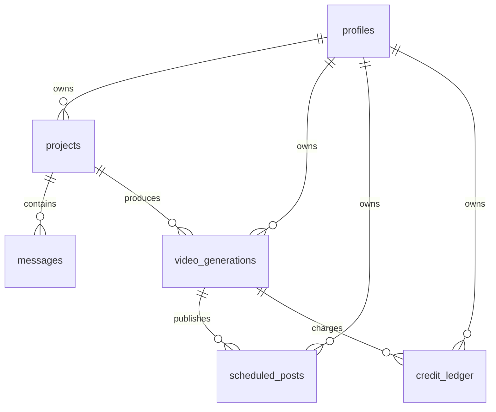
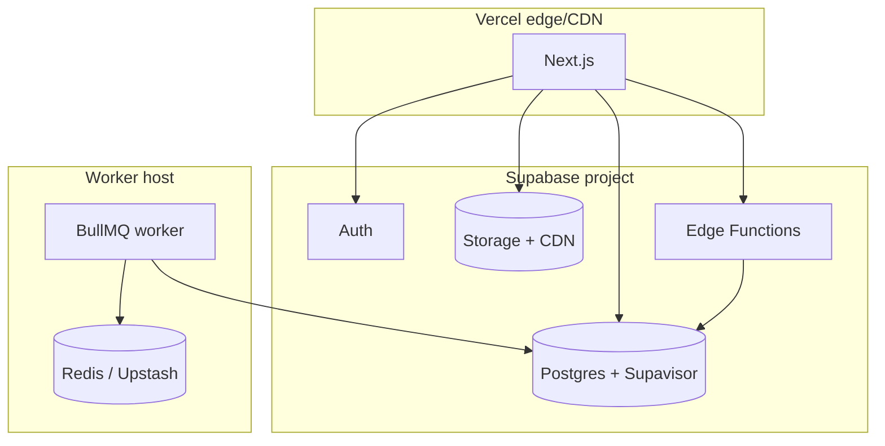

# Production Readiness Review

Beyond Social — architecture, scalability, security, and reliability review with a
prioritized path to production for millions of users. Scope is the codebase as of
the `feature/backend-integration` branch (Next.js web app, Supabase schema and
edge functions, kie.ai video generation, BullMQ worker skeleton).

## Executive Summary

The product is architecturally sound for its stage: a serverless Next.js front end,
Supabase for auth/data/storage, kie.ai for video generation behind Supabase Edge
Functions, and a queue-based worker for background jobs. Separation of concerns is
good, RLS is enforced everywhere, and the generation flow is async and idempotent.

It is **not yet production-ready**. The blockers are operational rather than
structural: temporary kie.ai result URLs are persisted instead of copied to durable
storage, database access from serverless functions has no connection pooler
configured, rate limiting is per-instance, there is no distributed cache, and there
is no observability or CI deploy pipeline. None require a rewrite; each is a scoped
change.

**Readiness score: 62 / 100** (see breakdown at the end).

---

## Critical Issues

### C1. kie.ai result URLs are temporary but stored as the source of truth

- **Problem:** kie.ai documents that "generated video URLs have certain validity
  periods." `complete_generation` and the callback store `resultUrls[0]` directly in
  `video_generations.result_url`. After the URL expires, every draft, editor preview,
  and scheduled post points at a dead link.
- **Impact:** Silent, permanent data loss of the core asset. Affects 100% of videos.
- **Risk:** Critical.
- **Fix:** In `kie-callback` / `poll-generation`, download the asset and upload it to
  the private `uploads` bucket (or a `renders` bucket), then store the Supabase
  storage path. Serve via a signed URL or public CDN path.

```ts
// supabase/functions/_shared/store.ts (sketch)
export async function persistRender(admin, userId, taskId, sourceUrl) {
  const res = await fetch(sourceUrl);
  const bytes = new Uint8Array(await res.arrayBuffer());
  const path = `${userId}/${taskId}.mp4`;
  await admin.storage
    .from("renders")
    .upload(path, bytes, { contentType: "video/mp4", upsert: true });
  return path; // store this, not the kie.ai URL
}
```

- **Why better:** The asset outlives the provider URL and is served from your CDN.
- **Trade-off:** Storage + egress cost (see Cost). Worth it; the asset is the product.

### C2. No database connection pooler for serverless access

- **Problem:** Every Vercel function and edge function opens its own Postgres
  connection. Postgres caps connections (~60 on small instances); serverless fan-out
  exhausts them under load.
- **Impact:** `remaining connection slots are reserved` errors — a hard outage at a
  few hundred concurrent requests.
- **Risk:** Critical at scale.
- **Fix:** Use Supabase **Supavisor** in transaction mode (port 6543) for all
  serverless DB access; keep session mode only where prepared statements are needed.
- **Trade-off:** Transaction pooling disables some session features; the app does not
  rely on them.

### C3. No observability

- **Problem:** No error tracking, metrics, tracing, or alerting. `logger` exists but
  nothing ingests it.
- **Impact:** Incidents are invisible; MTTR is unbounded.
- **Risk:** Critical for operations.
- **Fix:** Sentry (errors) + Vercel Analytics or OpenTelemetry → a backend
  (Grafana/Datadog). Alert on 5xx rate, `kie-callback` failures, and credit anomalies.

---

## High Priority

- **H1. Distributed rate limiting.** `lib/rate-limit.ts` is in-memory and per-instance;
  serverless makes it near-useless. Move to Upstash Redis (`@upstash/ratelimit`) keyed
  by IP and email. Add CAPTCHA after N failures.
- **H2. Webhook hardening.** `kie-callback` authenticates via a query-string secret
  (can leak in logs). Move the secret to a header, and add a dead-letter path: if the
  RPC fails, enqueue a retry rather than dropping the event. `complete_generation` is
  already idempotent — keep that property.
- **H3. Nonce-based CSP.** The current CSP allows `script-src 'unsafe-inline'` because
  the App Router injects inline bootstrap scripts. Generate a per-request nonce in
  middleware and switch to `'nonce-…' 'strict-dynamic'` to close the XSS gap.
- **H4. Publishing pipeline reliability.** Scheduled posts have no worker yet. The
  `scheduled_posts_due_idx` supports the query; add a worker that claims due rows with
  `for update skip locked`, publishes idempotently (store `external_id`), retries with
  backoff, and dead-letters after N attempts.
- **H5. Credit race at start.** `generate-video` checks credits then starts; two
  concurrent requests can both pass. Charge is on completion (good), but a hostile
  client could queue many generations. Reserve credits at start (a `pending` ledger
  row) or cap concurrent `generating` rows per user.

## Medium Priority

- **M1. Caching.** Trends and dashboard aggregates re-query Postgres every load. Add
  short-TTL caching (Next `revalidate`, or Redis) for read-heavy, low-cardinality data.
- **M2. Pagination.** `messages` and `video_generations` lists have no cursor
  pagination; a long project will load unboundedly. Add keyset pagination on
  `(created_at, id)`.
- **M3. Bundle size.** `/login` and `/signup` first-load JS is ~210 kB (RHF + Zod +
  Supabase). Lazy-load the Supabase client and defer non-critical form logic.
- **M4. Idempotency keys** on `generate-video` so a retried request does not create a
  duplicate task.
- **M5. `next/image` remote patterns / render CDN** once renders move to storage (C1).

## Low Priority

- **L1. `reset_due_credits`** needs a scheduler (Supabase cron / `pg_cron`).
- **L2. Storage lifecycle** — expire abandoned `uploads` after N days.
- **L3. Structured request IDs** threaded from middleware into `logger` for tracing.
- **L4. E2E tests** for the generation and publish flows (Playwright + local Supabase).

---

## Scalability Review

Video compute is offloaded to kie.ai, so the app tier scales with request volume, not
CPU. The bottlenecks are the database, the cache layer, and provider cost.

| Users | What breaks                                                             | Fix                                                                                                                     | Monthly cost signal                        |
| ----- | ----------------------------------------------------------------------- | ----------------------------------------------------------------------------------------------------------------------- | ------------------------------------------ |
| 10    | Nothing                                                                 | Supabase Free + Vercel Hobby                                                                                            | ~$0 + kie.ai usage                         |
| 1k    | DB connections start to matter; in-memory rate limit inconsistent       | Supavisor pooling (C2); Upstash rate limit (H1)                                                                         | Supabase Pro $25 + Vercel Pro $20 + kie.ai |
| 100k  | Read contention on dashboard/trends; webhook throughput; storage egress | Redis cache (M1); read replicas; renders on CDN (C1)                                                                    | Low hundreds + kie.ai (dominant)           |
| 1M    | Single primary write ceiling; publish worker throughput; cache stampede | Horizontal workers; queue durability (QStash/SQS); request coalescing; partition hot tables                             | Low thousands + kie.ai                     |
| 10M   | Regional latency; single-region DB; cost of egress and generation       | Multi-region read replicas + edge cache; shard by `user_id`; commit-heavy tables partitioned; negotiated kie.ai pricing | Dominated by kie.ai + egress               |

**Strategy, in order of value:** connection pooling → CDN for renders → distributed
cache and rate limiting → durable queue + horizontal workers → read replicas →
sharding/multi-region (only past ~1M active users; not before).

Recommended primitives: **horizontal scaling** (stateless web/workers), **CDN**
(renders, static), **Redis cache** (trends, aggregates, rate limits), **queue +
workers** (publishing, trend refresh), **read replicas** (dashboards). Microservices
and sharding are **not** justified until the single-primary write path is measurably
the ceiling.

---

## Security Review

- **Auth:** Supabase Auth; generic non-enumerating errors; RLS on every table; service
  role confined to edge functions. Good.
- **Authorization:** owner-scoped RLS policies; privileged transitions only via
  SECURITY DEFINER functions locked to `service_role`. Good.
- **Injection:** parameterized Supabase queries; Zod validation at boundaries; no raw
  SQL from user input. Good. **SSRF risk (C1 fix):** when persisting renders, only
  fetch kie.ai-origin URLs, never user-supplied ones.
- **XSS:** React escaping + CSP; tighten to nonce (H3).
- **CSRF:** Supabase cookie auth + same-site; server actions are origin-checked by
  Next. Acceptable.
- **Secrets:** `.env` git-ignored; service role never reaches the browser. Verify no
  key is ever passed to a Client Component.
- **Rate limiting / brute force:** present but per-instance (H1); add CAPTCHA.
- **Webhook:** shared-secret today (H2).
- **File uploads:** private bucket, per-user path policy; add content-type/size limits
  and virus scanning before public exposure.
- **Cookies:** `@supabase/ssr` sets secure, http-only cookies; confirm `Secure` in prod.

---

## Performance Review

- **Target P95 < 200 ms** is achievable for reads once pooling (C2) and caching (M1)
  land; today reads are dummy data so the number is not yet meaningful.
- **Frontend:** no obvious unnecessary re-renders; images optimized (AVIF/WebP);
  reduce auth-route bundles (M3); lazy-load the editor timeline.
- **Backend:** generation is async (non-blocking); polling every 3 s is fine for demo
  but should prefer the webhook in production to cut read load.
- **Memory:** the conversation thread clears timers/intervals on unmount. Good.

---

## Database Review

Schema (migrations `0002`–`0004`) is normalized, fully RLS'd, and indexed on the hot
paths (`projects(user_id, updated_at)`, `video_generations(user_id, status)` and a
partial unique index on `provider_task_id`, `scheduled_posts` due-partial index,
`credit_ledger(user_id)`). Constraints and cascades are correct.

Gaps: connection pooling (C2), keyset pagination (M2), a scheduler for
`reset_due_credits` (L1), and — at very high scale — partitioning `messages` and
`video_generations` by month or hashing by `user_id`.

---

## API Review

- Edge functions: correct method guards, CORS, JWT verification where required, generic
  errors. `generate-video` validates input and checks credits. Add idempotency (M4).
- Server actions return typed discriminated unions; validated with Zod; no data
  leakage. Good.
- Add consistent error envelopes and request IDs (L3).

---

## Infrastructure Review

- **Deploy:** Vercel (web), Supabase (DB/Auth/Storage/Edge Functions). Worker needs a
  host (Railway/Fly/Render) with Redis.
- **CI/CD:** lint/type/build run locally; add GitHub Actions to gate PRs and to run
  `supabase db push` + `supabase functions deploy` on merge.
- **Local infra:** add `docker-compose.yml` for Redis (worker) so `./start.sh` can run
  the full stack; document Supabase CLI + Deno for edge functions.
- **HTTPS/HSTS:** headers set; enforce `Secure` cookies and HTTPS-only in prod.
- **Secrets:** Vercel/Supabase project envs; never in the repo.

---

## Cost Optimization

kie.ai generation is the dominant variable cost and scales linearly with videos — cache
nothing there, but let users preview/trim before paying (charge on completion is
already correct). Second is storage egress once renders are hosted (C1): put a CDN in
front and set cache headers. Postgres and Vercel are minor until ~100k users. Use
Upstash (pay-per-request) for cache/rate-limit rather than a always-on Redis at low
scale. Kubernetes is not justified; serverless + a single worker host is cheaper and
simpler well past launch.

---

## Refactoring Suggestions

- Extract a `lib/data/*` repository layer so components/actions never call Supabase
  directly — one place to add caching, pagination, and tracing.
- Share the generation status enum and DTOs between the web app and edge functions via
  a small `packages/contracts` package to prevent drift.
- Introduce a typed `Result<T, E>` helper to standardize action/edge-function returns.

---

## Migration Plan

1. **Durability (C1):** add a `renders` bucket, persist renders in the callback, store
   storage paths, backfill nothing (new only). Ship behind the existing guard.
2. **Pooling (C2):** point serverless clients at Supavisor; load test.
3. **Observability (C3):** Sentry + log drain + alerts.
4. **Rate limit + webhook (H1, H2):** Upstash limiter; header-based webhook secret + DLQ.
5. **Publish worker (H4):** claim-and-publish loop with retries; wire Upload-post.
6. **CSP nonce, caching, pagination (H3, M1, M2).**
7. **CI/CD + docker-compose + scheduler (Infra, L1).**

Each step is independently shippable and reversible.

## Production Readiness Score (/100)

| Area                      | Score      | Notes                                           |
| ------------------------- | ---------- | ----------------------------------------------- |
| Architecture & modularity | 9/10       | Clean separation; async generation              |
| Data model & RLS          | 9/10       | Indexed, owner-scoped, idempotent functions     |
| Security                  | 7/10       | RLS solid; CSP + rate limit + webhook to harden |
| Reliability               | 5/10       | No DLQ, retries, or render durability (C1)      |
| Scalability               | 6/10       | Needs pooling, cache, workers                   |
| Performance               | 6/10       | Good foundation; unproven under real load       |
| Observability             | 2/10       | Logger only; nothing ingested                   |
| DevOps / CI-CD            | 5/10       | Local gates good; no deploy pipeline            |
| Cost control              | 8/10       | Charge-on-completion; CDN pending               |
| **Total**                 | **62/100** | Solid foundation; operational gaps remain       |

## Next Recommended Task

**Fix C1 (persist renders to storage).** It protects the core asset from silent loss,
unblocks the CDN work, and is a contained change to `kie-callback` / `poll-generation`
plus a `renders` bucket migration. Do it before wiring any real generations.

---

## Diagrams

### System architecture



### Generation request lifecycle



### Database ER (core tables)



### Deployment architecture


