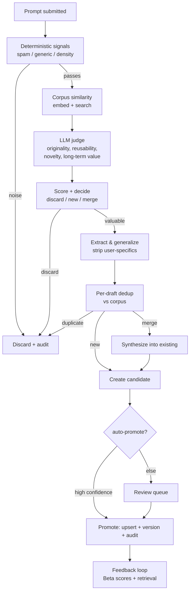

# Prompt Learning Infrastructure

An AI knowledge engine that decides what to learn. Every submitted prompt is
evaluated before anything else happens; only knowledge that is valuable, novel,
and non-duplicative enters the base, and every change is versioned and audited.
The base gets _cleaner and stronger_ over time, not merely larger.

Implementation: `packages/prompt-engine/src/learning` and `src/schema/learning.ts`.
Storage: migration `0008_prompt_learning.sql`. This complements the retrieval
system in [ARCHITECTURE.md](ARCHITECTURE.md).

## The loop

## 1. Evaluation is a scoring framework, not a yes/no

A prompt is scored on ten dimensions (`schema/learning.ts`): originality,
reusability, specificity, clarity, information density, domain relevance,
novelty, long-term value, frequency, outcome quality. Five are **programmatic**
(`learning/signals.ts`) and five are **LLM-judged** (`learning/prompt-evaluator.ts`).

- **Decision, not verdict.** The weighted aggregate plus corpus similarity yields
  one of three actions: `discard`, `new_chunk`, `merge`. Similarity gates the
  new-vs-merge-vs-duplicate distinction; novelty is capped by how close the
  nearest existing chunk is.
- **Confidence and explanation.** Every evaluation carries a confidence (from
  evidence volume and internal agreement) and a human-readable `decisionReason`.
  Nothing is accepted or rejected silently.
- **Trade-off:** deterministic-first ordering means obvious noise never costs an
  LLM call or an embedding, at the price of a few hard-coded heuristics. Those
  heuristics are cheap, explainable, and easy to tune, which is the right trade
  for a hot path that will run on every prompt.

## 2. Intelligent chunking strips the personal, keeps the reusable

For valuable prompts, `learning/extractor.ts` uses an LLM to generalize the
request into durable craft and **remove user-specific details** (names, brands,
one-off parameters). It emits 1-3 draft chunks in the claim/why/example shape,
validated against the chunk schema; anything malformed (e.g. a hallucinated
category) is dropped, never stored.

- **Why an LLM, not rules:** generalization and PII-stripping require
  understanding, not regexes. The output is still schema-validated and gated, so
  the model proposes and the gate disposes.

## 3. Deduplication and merge prevent knowledge pollution

Each draft is embedded and searched against the corpus (`learning/pipeline.ts`):

- `>= duplicateSimilarity` with low novelty -> **dropped**.
- `>= mergeSimilarity` -> **synthesized** into the existing chunk
  (`learning/merge.ts`), producing a tighter note and a bumped version, not a
  near-duplicate.
- otherwise -> a **new** candidate.

This is the core anti-bloat mechanism: overlapping knowledge sharpens what
exists. **Trade-off:** merges cost an extra LLM call and risk over-compression;
we mitigate with versioning (every merge is reversible) and human review by
default.

## 4. Safety gates, versioning, and audit

Before anything enters the base, in order: spam/noise filter, quality threshold,
duplicate check, merge-or-create, schema validation, **version snapshot**
(`prompt_chunk_versions`, append-only), and an **audit entry**
(`prompt_audit_log`, immutable) for every action. Candidates default to a review
queue (`reviewByDefault`); only high-confidence, high-value items auto-promote,
and only when policy allows.

## 5. Retrieval intelligence

Retrieval is deliberately not similarity-only (`retrieval/rank.ts`). Final
relevance blends RRF-fused dense+sparse similarity, cross-encoder rerank,
feedback quality and confidence, time-decayed popularity, **real-world success
rate** (accept/(accept+reject)), **freshness** (recency within the candidate
set), and **context match** (the chunk's applicability vs the request's platform
and product type). Weights are recipe-versioned, so ranking is reproducible and
A/B-testable.

## 6. Continuous learning

Outcomes feed back through the existing feedback loop (Beta-Bernoulli scoring):
accepts, rejects, edits, retries, and ratings update each in-context chunk's
quality and success rate, which in turn change future ranking. Heavy edits are a
learning signal that flows back into this same ingestion pipeline as new
candidates. Over time high-performing knowledge rises and low-value knowledge is
retired (`feedback/decay.ts`).

## Long-term architecture (designed-for, not yet built)

- **Scale** (millions of interactions, 100k+ chunks): candidates and audit are
  cheap appends; the hot path is retrieval, which rides pgvector HNSW and the
  `VectorStore` port (swappable to Qdrant/Turbopuffer). Evaluation is stateless
  and horizontally scalable; run ingestion on the existing BullMQ worker.
- **A/B testing:** `prompt_experiments` stores variant recipes/weights and
  metrics; because every generation records its recipe+chunk versions, outcomes
  attribute cleanly to a variant.
- **Multi-tenant workspaces:** every candidate/audit row carries a nullable
  `workspace_id`; retrieval filters and learning scope by it when tenancy is
  turned on, with a shared global base underneath.
- **Fine-tuning datasets:** the generation log (request + recipe + chunks +
  outcome + evaluation) plus the audit trail is a ready-made, labeled dataset for
  future SFT/RL, exportable without new instrumentation.
- **Analytics:** audit + scores + experiments are the source tables for a
  knowledge-health dashboard (growth, merge rate, top/bottom chunks, acceptance).

## Key decisions, summarized

| Decision                           | Why                                                    | Trade-off                               |
| ---------------------------------- | ------------------------------------------------------ | --------------------------------------- |
| Deterministic signals before LLM   | Cheap, explainable noise gate on a per-prompt hot path | A few tunable heuristics to maintain    |
| Scoring framework over yes/no      | Nuanced, auditable, tunable decisions                  | More surface than a boolean             |
| LLM extraction + schema validation | Generalization/PII-stripping need understanding        | Model proposes; gate must validate      |
| Merge over duplicate               | Base gets sharper, not bigger                          | Extra LLM call; mitigated by versioning |
| Review-by-default                  | Prevents pollution from auto-ingest                    | Human in the loop until trust is earned |
| Ports for store/embed/LLM          | Swap providers and scale without rewrites              | One indirection layer                   |
